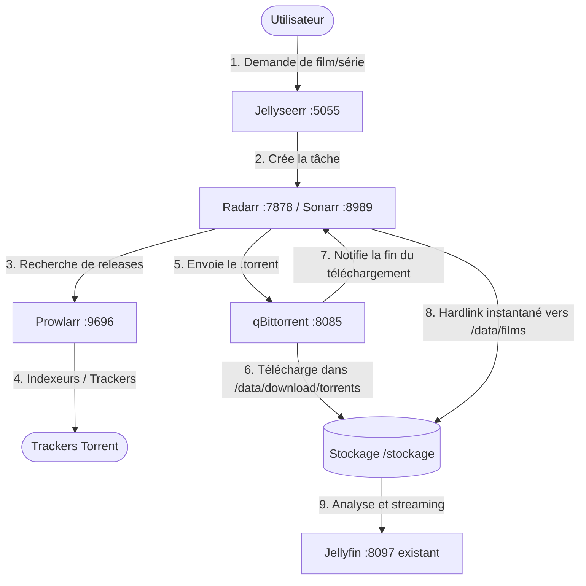

# ArgoCD Media Stack (Servarr Suite & Jellyseerr)

Ce repository constitue la **source unique de vérité (SSoT)** pour le déploiement GitOps de la stack d'automatisation multimédia complète (**Jellyseerr**, **Radarr**, **Sonarr**, **Prowlarr**, **qBittorrent**) via **Argo CD** sur un cluster **K3s**.

La stack est interconnectée avec l'instance **Jellyfin** existante du cluster.

---

## 🎯 Architecture & Flux Multimédia



### Principes Clés
- **Zéro Duplication Disque (Hardlinks TRaSH Guides)** : Le volume `/stockage` est monté sous `/data` dans tous les conteneurs devant manipuler les médias (`/data/download/torrents`, `/data/films`, `/data/series`). Comme ils résident sur le même système de fichiers physique (`/dev/sda1`), le déplacement de fichier est atomique et instantané.
- **Ordonnancement Local** : Les pods utilisent `nodeSelector: kubernetes.io/hostname: linux2` afin d'être exécutés sur la machine hébergeant physiquement les disques.

---

## 🌐 Exposition Réseau & Accès LAN

Tous les composants sont exposés sur le réseau local via des services `LoadBalancer` (Klipper-LB) :

| Application | Port LAN Direct | Port Conteneur | Description |
| :--- | :--- | :--- | :--- |
| **Jellyseerr** | `http://192.168.1.160:5055` | `5055` | Interface de découverte & requêtes |
| **Radarr** | `http://192.168.1.160:7878` | `7878` | Gestionnaire de films |
| **Sonarr** | `http://192.168.1.160:8989` | `8989` | Gestionnaire de séries |
| **Prowlarr** | `http://192.168.1.160:9696` | `9696` | Gestionnaire d'indexeurs |
| **qBittorrent WebUI** | `http://192.168.1.160:8085` | `8080` | Client de téléchargement |
| **qBittorrent Torrent**| `6882` (TCP/UDP) | `6882` | Port d'écoute BitTorrent |
| *Jellyfin (existant)* | `http://192.168.1.160:8097` | `8096` | Serveur de streaming |

Un Ingress Traefik est également configuré pour les hôtes `*.local` (`jellyseerr.local`, `radarr.local`, `sonarr.local`, `prowlarr.local`, `qbittorrent.local`).

---

## 📁 Structure du Repository

```text
.
├── .github/workflows/
│   └── validate.yaml                    # Validation CI Kustomize à chaque push/PR
│
├── apps/workloads/
│   └── media-stack.yaml                 # CRD Application Argo CD
│
├── manifests/workloads/media-stack/
│   ├── base/
│   │   ├── namespace.yaml               # Namespace 'media' (Wave -2)
│   │   ├── pv-pvc-media.yaml            # PV/PVC partagé /stockage (Wave 0)
│   │   ├── pv-pvc-configs.yaml          # PV/PVC dédiés pour chaque application (Wave 0)
│   │   ├── qbittorrent/                 # Deployment + Service
│   │   ├── prowlarr/                    # Deployment + Service
│   │   ├── radarr/                      # Deployment + Service
│   │   ├── sonarr/                      # Deployment + Service
│   │   ├── jellyseerr/                  # Deployment + Service
│   │   ├── ingress.yaml                 # Ingress Traefik (Wave 3)
│   │   └── kustomization.yaml
│   └── overlays/prod/
│       └── kustomization.yaml           # Point d'entrée de production Kustomize
│
├── scripts/
│   └── init-directories.sh             # Initialisation des dossiers sur linux2
│
├── normeetprojet.md                     # Charte d'architecture et de gouvernance GitOps
├── action.md                            # Suivi opérationnel du plan d'action
└── README.md                            # Ce fichier
```

---

## 🚀 Déploiement via Argo CD

1. **Préparation des répertoires sur `linux2`** (déjà effectué) :
   ```bash
   bash scripts/init-directories.sh
   ```

2. **Déploiement de l'Application Argo CD** :
   ```bash
   kubectl apply -f apps/workloads/media-stack.yaml
   ```

3. **Vérification dans Argo CD** :
   L'application `media-stack` synchronise automatiquement l'ensemble des composants dans le namespace `media`.

---

## ⚙️ Configuration Post-Déploiement

1. **Prowlarr** (`:9696`) :
   - Ajouter vos indexeurs (trackers privés/publics).
   - Dans *Settings > Apps*, ajouter Radarr (`http://radarr.media.svc:7878`) et Sonarr (`http://sonarr.media.svc:8989`) avec leurs clés API. Prowlarr synchronisera automatiquement les indexeurs.

2. **Radarr & Sonarr** (`:7878` / `:8989`) :
   - Dans *Settings > Download Clients*, ajouter qBittorrent :
     - **Host** : `qbittorrent.media.svc`
     - **Port** : `8080` (ou `8085`)
     - **Use SSL** : Décoché
     - **Username** : `admin`
     - **Password** : Mot de passe WebUI (temporaire `PcmLU3teF` ou défini dans qBittorrent)
   - Dans *Settings > Media Management*, activer les **Hardlinks**.
   - Chemins racines des médiathèques :
     - Radarr : `/data/films`
     - Sonarr : `/data/series`

3. **Jellyseerr** (`:5055`) :
   - Assistant d'initialisation : connecter votre Jellyfin (`http://jellyfin.jellyfin.svc:8096`).
   - Connecter Radarr et Sonarr pour automatiser les requêtes des utilisateurs.