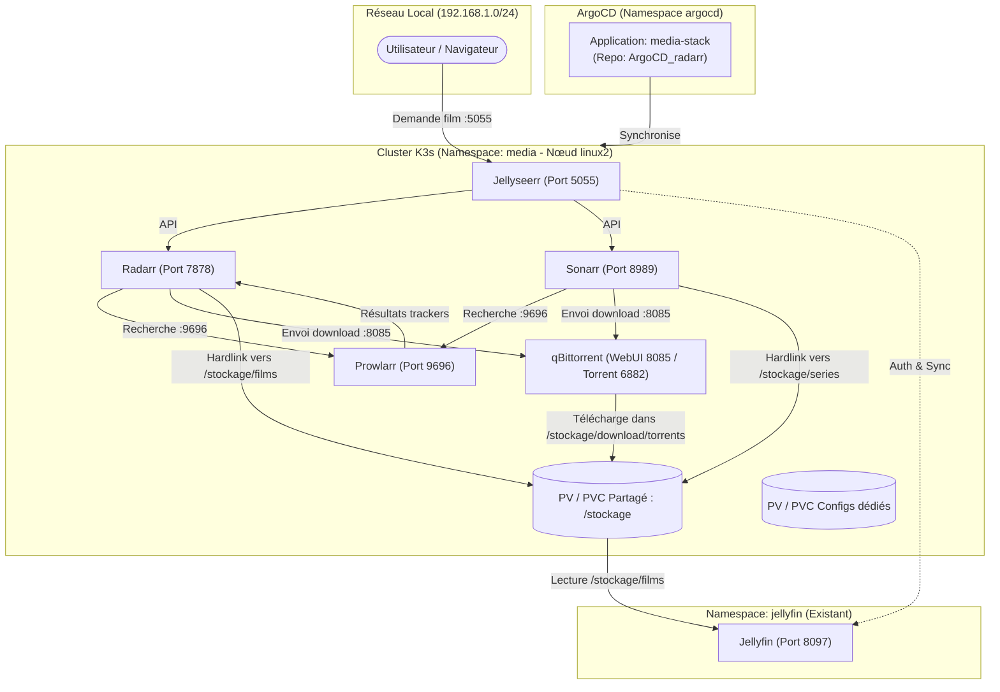

# Plan d'Action Affiné : Déploiement GitOps de la Stack Servarr (ArgoCD & K3s)

Ce document formalise le plan d'action adapté et calibré sur l'infrastructure réelle découverte lors de l'audit du cluster K3s sur **`linux2` (`192.168.1.160`)**.

---

## 1. Synthèse de l'Audit d'Infrastructure Réel

### 1.1. Topologie du Cluster K3s
- **Nœud Master / Stockage** : `linux2` (`192.168.1.160`, Ubuntu 22.04 LTS, amd64, k3s v1.36.4).
- **Nœuds Workers** : `mini` (`192.168.1.99`, amd64), `pi1` (`192.168.1.24`, arm64), `piblanc` (`192.168.1.50`, arm64).
- **Règle d'ordonnancement** : Tous les workloads Servarr doivent comporter `nodeSelector: kubernetes.io/hostname: linux2` car le disque physique volumineux et les points de montage médias y sont attachés localement.

### 1.2. Cartographie du Stockage
- **Disque principal `/stockage`** (`/dev/sda1`, 7.3 To, 2.2 To disponibles) :
  - `/stockage/films` : Répertoire actuel des films (déjà référencé dans Jellyfin).
  - `/stockage/download` : Répertoire des téléchargements (sous-dossiers existants : `complete`, `completed`, `incoming`, `temp`, `watched`).
  - `/stockage/k8s-jellyfin-config` : Configuration persistante de Jellyfin.
  - **Avantage majeur** : Étant sur le même système de fichiers ext4 (`/dev/sda1`), les **hardlinks / atomic moves** entre les téléchargements de qBittorrent et les films de Radarr fonctionneront instantanément et sans duplication d'espace.
- **Autres disques disponibles** :
  - `/montage1` (1.8 To) : divers (`aventure`, `dreamworks`, `pixar`, etc.).
  - `/montage2` (1.8 To) : `download`.
  - `/montage3` (1.8 To) : séries (`viellesseries`), `Audiobooks`.

### 1.3. État du Jellyfin existant & ArgoCD
- Déployé via ArgoCD Application `jellyfin` depuis `https://github.com/xelnagas/jargocd_jellyfin.git`.
- Namespace : `jellyfin`.
- Service : `LoadBalancer` sur le port LAN **`8097`** (redirige vers le port conteneur `8096`).
- Jellyfin monte les répertoires `/data/stockage`, `/data/montage1`, `/data/montage2`, `/data/montage3`.
- Ingress Controller actif : **Traefik** (default class `traefik`).
- Service Type : Klipper-LB actif, permettant d'exposer des ports dédiés en `LoadBalancer` directement sur les IPs locales.

### 1.4. Normes GitOps Validées (Conformes à la charte `normeetprojet.md`)
- Moteur : **Kustomize** avec découpage `base/` et `overlays/prod/`.
- Gestion des vagues de déploiement (**Sync Waves**) :
  - `Wave -2` : Namespace
  - `Wave 0` : PV / PVC, ConfigMaps, Services
  - `Wave 2` : Deployments
  - `Wave 3` : Ingress
- Images Docker : **Tags immuables obligatoires** (aucun `:latest`).
- Droits : `PUID: "1000"`, `PGID: "1000"`, `securityContext: fsGroup: 1000`.
- Sondes obligatoires : `startupProbe`, `livenessProbe`, `readinessProbe`.
- Dimensionnement strict des ressources (`requests` et `limits`).

---

## 2. Architecture Cible de la Stack dans ce Repository



### 2.1. Matrice des Ports & Services

| Composant | Port Conteneur | Port Externe (`LoadBalancer`) | URL LAN Directe | URL Interne K8s (ClusterIP) |
| :--- | :--- | :--- | :--- | :--- |
| **Jellyseerr** | `5055` | `5055` | `http://192.168.1.160:5055` | `http://jellyseerr.media.svc:5055` |
| **Radarr** | `7878` | `7878` | `http://192.168.1.160:7878` | `http://radarr.media.svc:7878` |
| **Sonarr** | `8989` | `8989` | `http://192.168.1.160:8989` | `http://sonarr.media.svc:8989` |
| **Prowlarr** | `9696` | `9696` | `http://192.168.1.160:9696` | `http://prowlarr.media.svc:9696` |
| **qBittorrent WebUI** | `8080` | `8085` | `http://192.168.1.160:8085` | `http://qbittorrent.media.svc:8080` |
| **qBittorrent Torrent**| `6882` | `6882` (TCP/UDP) | Port Torrent entrant | - |
| *Jellyfin (existant)* | `8096` | `8097` | `http://192.168.1.160:8097` | `http://jellyfin.jellyfin.svc:8096` |

> [!NOTE]
> Le port WebUI de qBittorrent est mappé sur le port **8085** sur le LAN pour ne pas interférer avec d'autres services locaux (ex: port 8080 de l'API K8s ou Traefik/Open-WebUI). Le port entrant torrent est positionné sur **6882** pour éviter tout conflit avec l'ancien conteneur rtorrent.

---

## 3. Structure du Repository GitOps (`ArgoCD_radarr`)

```text
ArgoCD_radarr/
├── .github/
│   └── workflows/
│       └── validate.yaml                    # Validation CI (kustomize build)
│
├── apps/
│   └── workloads/
│       └── media-stack.yaml                 # CRD Application Argo CD principale
│
├── manifests/
│   └── workloads/
│       └── media-stack/
│           ├── base/
│           │   ├── namespace.yaml           # Namespace 'media' (Wave -2)
│           │   ├── pv-pvc-media.yaml        # PV/PVC partagé /stockage (Wave 0)
│           │   ├── pv-pvc-configs.yaml      # PV/PVC dédiés /config de chaque app (Wave 0)
│           │   ├── qbittorrent/
│           │   │   ├── deployment.yaml      # linuxserver/qbittorrent (Wave 2)
│           │   │   └── service.yaml         # WebUI 8085 + Torrent 6882 (Wave 0)
│           │   ├── prowlarr/
│           │   │   ├── deployment.yaml      # linuxserver/prowlarr (Wave 2)
│           │   │   └── service.yaml         # WebUI 9696 (Wave 0)
│           │   ├── radarr/
│           │   │   ├── deployment.yaml      # linuxserver/radarr (Wave 2)
│           │   │   └── service.yaml         # WebUI 7878 (Wave 0)
│           │   ├── sonarr/
│           │   │   ├── deployment.yaml      # linuxserver/sonarr (Wave 2)
│           │   │   └── service.yaml         # WebUI 8989 (Wave 0)
│           │   ├── jellyseerr/
│           │   │   ├── deployment.yaml      # fallenbagel/jellyseerr (Wave 2)
│           │   │   └── service.yaml         # WebUI 5055 (Wave 0)
│           │   ├── ingress.yaml             # Ingress Traefik unifié (Wave 3)
│           │   └── kustomization.yaml
│           │
│           └── overlays/
│               └── prod/
│                   └── kustomization.yaml   # Overlay environnement de production
│
├── scripts/
│   └── init-directories.sh                 # Script de préparation des dossiers sur linux2
│
├── normeetprojet.md                         # Charte de gouvernance GitOps
├── README.md                                # Documentation du repository
└── action.md                                # Ce document de suivi opérationnel
```

---

## 4. Déroulement du Plan d'Action par Étapes

### Étape 1 : Préparation du Système de Fichiers sur le Serveur `linux2`
- [x] Créer les répertoires d'accueil sur `/stockage` :
  - `/stockage/k8s-servarr-config/qbittorrent`
  - `/stockage/k8s-servarr-config/prowlarr`
  - `/stockage/k8s-servarr-config/radarr`
  - `/stockage/k8s-servarr-config/sonarr`
  - `/stockage/k8s-servarr-config/jellyseerr`
  - `/stockage/download/torrents`
  - `/stockage/series` (si absent)
- [x] Appliquer les droits adéquats : `chown -R 1000:1000 /stockage/k8s-servarr-config`.

### Étape 2 : Rédaction de la Charte et des Fichiers de Base
- [x] Créer `normeetprojet.md` (alignée avec la charte existante de Jellyfin).
- [x] Créer `manifests/workloads/media-stack/base/namespace.yaml` (namespace `media`).
- [x] Créer `manifests/workloads/media-stack/base/pv-pvc-media.yaml` :
  - PV/PVC pour monter `/stockage` vers `/data` dans les conteneurs.
- [x] Créer `manifests/workloads/media-stack/base/pv-pvc-configs.yaml` :
  - PV/PVC indépendants pour les répertoires `/config` de chaque application.

### Étape 3 : Rédaction des Workloads Applicatifs (Base)
- [x] **qBittorrent** :
  - Image : `lscr.io/linuxserver/qbittorrent:5.0.4`
  - Ports : 8080 (WebUI) et 6882 (Torrent TCP/UDP)
  - Montages : `/config` et `/data`
- [x] **Prowlarr** :
  - Image : `lscr.io/linuxserver/prowlarr:1.31.2.4975-ls109`
  - Port : 9696
  - Montage : `/config`
- [x] **Radarr** :
  - Image : `lscr.io/linuxserver/radarr:5.19.3.9730-ls243`
  - Port : 7878
  - Montages : `/config` et `/data`
- [x] **Sonarr** :
  - Image : `lscr.io/linuxserver/sonarr:4.0.13.2934-ls256`
  - Port : 8989
  - Montages : `/config` et `/data`
- [x] **Jellyseerr** :
  - Image : `fallenbagel/jellyseerr:2.3.0`
  - Port : 5055
  - Montage : `/config`
- [x] **Ingress** :
  - Déclaration Ingress Traefik (entrypoints `web`, `websecure`).

### Étape 4 : Assemblage Kustomize & Application Argo CD
- [x] Créer `manifests/workloads/media-stack/base/kustomization.yaml`.
- [x] Créer `manifests/workloads/media-stack/overlays/prod/kustomization.yaml`.
- [x] Créer l'Application Argo CD : `apps/workloads/media-stack.yaml` :
  - `repoURL`: `https://github.com/xelnagas/ArgoCD_radarr.git`
  - `targetRevision`: `main`
  - `path`: `manifests/workloads/media-stack/overlays/prod`
  - `destination`: `namespace: media`
- [x] Créer le workflow GitHub Actions de validation syntaxique `.github/workflows/validate.yaml`.

### Étape 5 : Validation Locale & Synchronisation Cluster
- [x] Tester la compilation Kustomize en local :
  ```powershell
  kubectl kustomize manifests/workloads/media-stack/overlays/prod
  ```
- [x] Commiter et pousser sur `origin/main`.
- [x] Appliquer l'application ArgoCD sur le cluster :
  ```bash
  kubectl apply -f apps/workloads/media-stack.yaml
  ```
- [x] Vérifier dans ArgoCD que l'application `media-stack` passe à l'état `Healthy` et `Synced`.

### Étape 6 : Interconnexion Applicative (Post-Déploiement)
- [ ] **Prowlarr** :
  - Ajouter les trackers torrents.
  - Ajouter les applications clientes (Radarr et Sonarr) avec synchronisation automatique.
- [ ] **Radarr & Sonarr** :
  - Ajouter le client de téléchargement qBittorrent (`http://qbittorrent.media.svc:8080`).
  - Définir le répertoire racine de la bibliothèque :
    - Radarr : `/data/films`
    - Sonarr : `/data/series`
  - Vérifier que le format d'import est configuré en hardlink.
- [ ] **Jellyseerr** :
  - Se connecter à l'interface `http://192.168.1.160:5055`.
  - Connecter Jellyfin (`http://jellyfin.jellyfin.svc:8096` ou `http://192.168.1.160:8097`).
  - Connecter Radarr et Sonarr.
- [ ] **Jellyfin** :
  - Vérifier que la bibliothèque Films scanne bien `/data/stockage/films`.

### Étape 7 : Test Fonctionnel Complet (End-to-End)
- [ ] Réaliser une demande de film via Jellyseerr.
- [ ] Vérifier la transmission vers Radarr, le lancement du téléchargement dans qBittorrent, l'import par hardlink dans `/stockage/films`, et la disponibilité finale dans Jellyfin.
