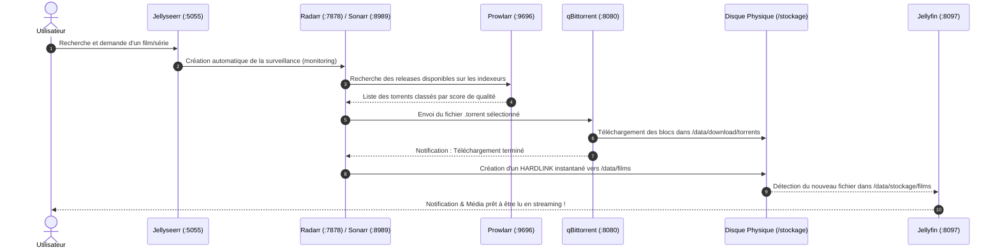

# Manuel Utilisateur : Suite Multimédia Automatisée (Servarr & Jellyseerr)

Ce manuel détaille l'utilisation, la configuration initiale et la maintenance au quotidien de votre plateforme multimédia automatisée déployée via **Argo CD** sur le cluster **K3s**.

---

## 📑 Sommaire
1. [Vue d'Ensemble & Tableau de Bord des Accès](#1-vue-densemble--tableau-de-bord-des-accès)
2. [Fonctionnement Global du Flux Multimédia](#2-fonctionnement-global-du-flux-multimédia)
3. [Guide Pas-à-Pas de Configuration Initiale](#3-guide-pas-à-pas-de-configuration-initiale)
   - [3.1. qBittorrent (Client de Téléchargement)](#31-qbittorrent-client-de-téléchargement)
   - [3.2. Prowlarr (Gestionnaire d'Indexeurs)](#32-prowlarr-gestionnaire-dindexeurs)
   - [3.3. Radarr (Gestionnaire de Films)](#33-radarr-gestionnaire-de-films)
   - [3.4. Sonarr (Gestionnaire de Séries)](#34-sonarr-gestionnaire-de-séries)
   - [3.5. Jellyseerr (Portail Utilisateur & Demandes)](#35-jellyseerr-portail-utilisateur--demandes)
4. [Utilisation Quotidienne : Cycle de Vie d'un Média](#4-utilisation-quotidienne--cycle-de-vie-dun-média)
5. [Architecture de Stockage & Hardlinks (TRaSH Guides)](#5-architecture-de-stockage--hardlinks-trash-guides)
6. [Dépannage & Commandes Utiles](#6-dépannage--commandes-utiles)

---

## 1. Vue d'Ensemble & Tableau de Bord des Accès

Tous les composants de la stack s'exécutent sur le nœud physique **`linux2` (`192.168.1.160`)** et sont directement accessibles sur votre réseau local :

| Application | Rôle | URL LAN | Identifiants par Défaut / Configuration |
| :--- | :--- | :--- | :--- |
| 🎬 **Jellyseerr** | Portail de découverte & demandes | [http://192.168.1.160:5055](http://192.168.1.160:5055) | Authentification via compte Jellyfin |
| 🎥 **Radarr** | Gestionnaire de films | [http://192.168.1.160:7878](http://192.168.1.160:7878) | Pas de mot de passe initial (à configurer si souhaité) |
| 📺 **Sonarr** | Gestionnaire de séries | [http://192.168.1.160:8989](http://192.168.1.160:8989) | Pas de mot de passe initial (à configurer si souhaité) |
| 🔍 **Prowlarr** | Gestionnaire d'indexeurs torrents | [http://192.168.1.160:9696](http://192.168.1.160:9696) | Pas de mot de passe initial (à configurer si souhaité) |
| ⬇️ **qBittorrent** | Moteur de téléchargement BitTorrent | [http://192.168.1.160:8080](http://192.168.1.160:8080) *(ou :8085)* | Utilisateur : `admin`<br>Mot de passe initial : `PcmLU3teF` |
| 🍿 **Jellyfin** | Serveur de streaming *(existant)* | [http://192.168.1.160:8097](http://192.168.1.160:8097) | Vos comptes Jellyfin existants |

---

## 2. Fonctionnement Global du Flux Multimédia



---

## 3. Guide Pas-à-Pas de Configuration Initiale

Pour que l'automatisation fonctionne de bout en bout, réalisez les étapes de liaison suivantes dans l'ordre :

---

### 3.1. qBittorrent (Client de Téléchargement)
1. Rendez-vous sur [http://192.168.1.160:8080](http://192.168.1.160:8080).
2. Connectez-vous avec :
   - **Username** : `admin`
   - **Password** : `PcmLU3teF`
3. Allez dans **Outils** > **Options** :
   - **Interface Web** : Vous pouvez modifier le nom d'utilisateur et définir un nouveau mot de passe personnalisé.
   - **Téléchargements** : Vérifiez que le répertoire par défaut est bien `/data/download/torrents/`.
   - **Connexion** : Le port d'écoute entrant est fixé sur **`6882`**.

---

### 3.2. Prowlarr (Gestionnaire d'Indexeurs)
Prowlarr centralise tous vos trackers (publics et privés) et les propage automatiquement à Radarr et Sonarr.

1. Rendez-vous sur [http://192.168.1.160:9696](http://192.168.1.160:9696).
2. **Ajouter des Indexeurs** :
   - Allez dans **Indexers** > **Add Indexer** (`+`).
   - Recherchez vos trackers préférés (ex: *1337x*, *Torrent9*, *YggTorrent*, *ThePirateBay*, *Sharewood*, etc.).
   - Configurez vos identifiants si le tracker est privé, puis cliquez sur **Save**.
3. **Récupérer la clé API de Prowlarr** :
   - Allez dans **Settings** > **General**.
   - Dans la section *Security*, notez votre **API Key**.
4. **Relier Radarr et Sonarr à Prowlarr** :
   - Allez dans **Settings** > **Apps** > Cliquez sur `+`.
   - Choisissez **Radarr** :
     - **Prowlarr Server** : `http://prowlarr.media.svc:9696`
     - **Radarr Server** : `http://radarr.media.svc:7878`
     - **API Key** : *(Saisir la clé API de Radarr récupérée à l'étape 3.3)*
     - Cliquez sur **Test** puis **Save**.
   - Choisissez **Sonarr** :
     - **Prowlarr Server** : `http://prowlarr.media.svc:9696`
     - **Sonarr Server** : `http://sonarr.media.svc:8989`
     - **API Key** : *(Saisir la clé API de Sonarr récupérée à l'étape 3.4)*
     - Cliquez sur **Test** puis **Save**.
   - *Prowlarr synchronisera désormais automatiquement tous vos indexeurs vers Radarr et Sonarr !*

---

### 3.3. Radarr (Gestionnaire de Films)
1. Rendez-vous sur [http://192.168.1.160:7878](http://192.168.1.160:7878).
2. **Récupérer la clé API** :
   - Allez dans **Settings** > **General** > Noter l'**API Key** (utile pour Prowlarr et Jellyseerr).
3. **Connecter qBittorrent** :
   - Allez dans **Settings** > **Download Clients** > Cliquez sur `+` > Choisissez **qBittorrent**.
   - **Name** : `qBittorrent`
   - **Host** : `qbittorrent.media.svc`
   - **Port** : `8080`
   - **Use SSL** : *Décoché*
   - **Username** : `admin`
   - **Password** : `PcmLU3teF` *(ou votre mot de passe personnalisé)*
   - Cliquez sur **Test** (doit afficher une coche verte) puis **Save**.
4. **Configurer le dossier racine des films & les Hardlinks** :
   - Allez dans **Settings** > **Media Management** :
     - Cochez **Use Hardlinks instead of Copy** *(fondamental pour éviter les copies disques lentes)*.
   - En bas, dans **Root Folders** > Cliquez sur **Add Root Folder** :
     - Sélectionnez `/data/films`.
5. **Définir les profils de qualité** :
   - Dans **Settings** > **Profiles**, sélectionnez ou créez votre profil souhaité (ex: `HD-1080p` ou `Ultra-HD 4K` avec langue préférée French / Original).

---

### 3.4. Sonarr (Gestionnaire de Séries)
1. Rendez-vous sur [http://192.168.1.160:8989](http://192.168.1.160:8989).
2. **Récupérer la clé API** :
   - Allez dans **Settings** > **General** > Noter l'**API Key**.
3. **Connecter qBittorrent** :
   - Allez dans **Settings** > **Download Clients** > Cliquez sur `+` > Choisissez **qBittorrent**.
   - **Host** : `qbittorrent.media.svc`
   - **Port** : `8080`
   - **Use SSL** : *Décoché*
   - **Username** : `admin`
   - **Password** : `PcmLU3teF` *(ou votre mot de passe personnalisé)*
   - Cliquez sur **Test** puis **Save**.
4. **Configurer le dossier racine des séries & les Hardlinks** :
   - Dans **Settings** > **Media Management** :
     - Cochez **Use Hardlinks instead of Copy**.
   - Dans **Root Folders** :
     - Ajoutez le dossier `/data/series`.

---

### 3.5. Jellyseerr (Portail Utilisateur & Demandes)
Jellyseerr est la vitrine pour vous et vos proches. Il s'intègre directement à Jellyfin pour la gestion des utilisateurs et le statut des médias.

1. Rendez-vous sur [http://192.168.1.160:5055](http://192.168.1.160:5055).
2. **Assistant de démarrage (Initial Setup)** :
   - **Étape 1 : Connexion à Jellyfin** :
     - **Jellyfin URL** : `http://jellyfin.jellyfin.svc:8096` *(ou `http://192.168.1.160:8097`)*
     - **Email / Nom d'utilisateur** : Votre identifiant administrateur Jellyfin.
     - **Password** : Votre mot de passe Jellyfin.
     - Cliquez sur **Sign In**.
   - **Étape 2 : Synchronisation des Bibliothèques** :
     - Sélectionnez vos bibliothèques Jellyfin (ex: *Films*, *Séries*).
   - **Étape 3 : Connexion à Radarr** :
     - Cochez **Default Server**.
     - **Server Name** : `Radarr`
     - **Hostname or IP** : `radarr.media.svc`
     - **Port** : `7878`
     - **API Key** : Clé API de Radarr.
     - Cliquez sur **Test** : Jellyseerr charge automatiquement les profils et le dossier `/data/films`.
   - **Étape 4 : Connexion à Sonarr** :
     - Cochez **Default Server**.
     - **Server Name** : `Sonarr`
     - **Hostname or IP** : `sonarr.media.svc`
     - **Port** : `8989`
     - **API Key** : Clé API de Sonarr.
     - Cliquez sur **Test** : sélectionnez le profil et `/data/series`.
3. Cliquez sur **Finish Setup**.
4. Dans **Settings** > **Users**, vous pouvez importer vos utilisateurs Jellyfin afin qu'ils se connectent directement avec leurs identifiants Jellyfin !

---

## 4. Utilisation Quotidienne : Cycle de Vie d'un Média

Une fois la configuration initiale achevée, vous n'avez plus besoin d'accéder aux interfaces techniques de Radarr, Sonarr ou qBittorrent.

### Faire une demande :
1. Ouvrez **Jellyseerr** sur votre ordinateur, tablette ou smartphone ([http://192.168.1.160:5055](http://192.168.1.160:5055)).
2. Recherchez un film ou une série.
3. Cliquez sur **Request** (Demander).
4. **Traitement 100% autonome** :
   - Jellyseerr transmet la commande à Radarr / Sonarr.
   - Prowlarr trouve la meilleure release sur vos indexeurs.
   - qBittorrent lance le téléchargement.
   - Dès la fin du téléchargement, Radarr renomme proprement le fichier et crée un hardlink vers `/stockage/films`.
   - Jellyfin détecte instantanément l'apparition du film et télécharge ses métadonnées, jaquettes et affiches.
5. Ouvrez **Jellyfin** ([http://192.168.1.160:8097](http://192.168.1.160:8097)) : votre film est prêt à être visionné !

---

## 5. Architecture de Stockage & Hardlinks (TRaSH Guides)

### Pourquoi les Hardlinks ?
En BitTorrent classique, lorsqu'un téléchargement se termine, le logiciel doit déplacer le fichier dans la médiathèque. Si les dossiers sont sur des volumes distincts, Kubernetes effectue une **copie physique complète** (lente et doublant l'espace disque utilisé jusqu'à ce que le torrent soit supprimé).

Grâce à notre architecture :
- Le disque physique de 7,3 To `/stockage` (`/dev/sda1`) est monté sur le point commun `/data` dans les pods.
- `/data/download/torrents` et `/data/films` partagent la même table d'inodes ext4.
- **Un hardlink est créé en 1 milliseconde** : le fichier a deux chemins d'accès mais **n'occupe l'espace disque qu'une seule fois**.
- Vous pouvez continuer à seeder (partager) votre torrent dans qBittorrent pendant que vous lisez le film dans Jellyfin sans aucun impact d'espace.

```text
/stockage (Disque Physique /dev/sda1)
├── download/
│   ├── torrents/         <-- Fichiers en cours ou en partage (qBittorrent)
│   └── temp/
├── films/
│   ├── new/              <-- Nouveaux films téléchargés (Radarr & Bibliothèque Jellyfin "new films")
│   │   └── Inception (2010)/
│   │       └── Inception (2010) [1080p].mkv (Même inode que dans /torrents)
│   └── ... (anciennes catégories de films)
├── series/               <-- Séries organisées (Sonarr & Jellyfin)
└── k8s-servarr-config/   <-- Bases SQLite & configurations
```

---

## 6. Dépannage & Commandes Utiles

### Vérifier l'état de la stack dans Kubernetes :
Depuis votre poste ou en SSH sur `linux2` (`192.168.1.160`) :

```bash
# Vérifier l'état de synchronisation Argo CD
kubectl get application media-stack -n argocd

# Lister les pods et leur temps de fonctionnement
kubectl get pods -n media -o wide

# Vérifier les services et les ports réseau
kubectl get svc -n media
```

### Consulter les logs en temps réel :
```bash
# Logs de Radarr
kubectl logs -n media deployment/radarr -f

# Logs de qBittorrent
kubectl logs -n media deployment/qbittorrent -f

# Logs de Jellyseerr
kubectl logs -n media deployment/jellyseerr -f
```

### Redémarrer un composant :
```bash
kubectl rollout restart deployment/radarr -n media
kubectl rollout restart deployment/qbittorrent -n media
```

### Forcer une synchronisation Argo CD :
```bash
kubectl annotate application media-stack -n argocd argocd.argoproj.io/refresh=hard --overwrite
```

### Problème de résolution DNS sur les Indexeurs (Erreur "Name does not resolve") :
En France, les fournisseurs d'accès à Internet (Orange, SFR, Free, Bouygues) bloquent légalement les domaines de torrents (comme `torrent9.la`, `1337x.to`, etc.) par menteur DNS (`NXDOMAIN`).
Pour contourner ce blocage sans impacter la résolution interne du cluster, CoreDNS est configuré via `manifests/infrastructure/coredns-custom.yaml` pour déléguer les requêtes publiques vers les serveurs DNS de Cloudflare (`1.1.1.1`) et Google (`8.8.8.8`).
Si un nouveau TLD de tracker est bloqué, appliquez simplement :
```bash
kubectl apply -f manifests/infrastructure/coredns-custom.yaml
kubectl rollout restart deployment/coredns -n kube-system
```
